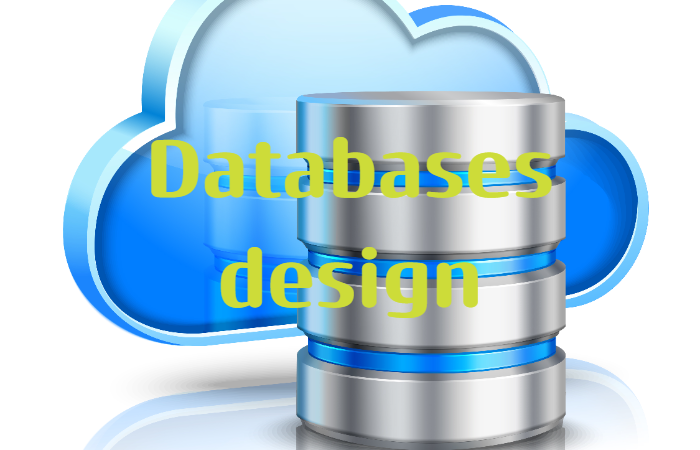
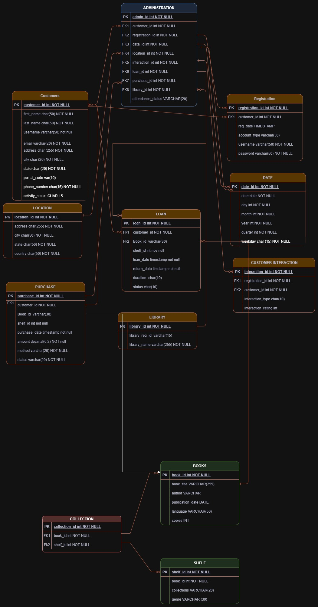

# Database-Design
This project aims to design and implement a robust relational database for a Library Management System (LMS) Called ELAB. The system will efficiently manage books, users, transactions, anddministrative tasks while ensuring data integrity, security, and scalability💻👨‍💻😊


 

 
 


## Table of Contents
- [Table of Contents](#table-of-contents)
  - [Business problem](#business-problem)
  - [Database Strategy](#database-strategy)
  - [Conceptual Design](#conceptual-design)
  - [Tech Stack](#tech-stack)
  (#Database Design)
  - [Database Schema](#Database-Schema)
  (#lessons-learned-and-recommendation)
  - [Limitation and what can be improved](#limitation-and-what-can-be-improved)
  - [Run Locally](#run-locally)
  - [Repository structure](#repository-structure)
  - [Contribution](#contribution)
  - [License](#license)


## Business problem
For creation,design and implementation a robust relational database for a Library Management System (LMS) Called ELAB. The system will efficiently manage books, users, purchases, researches, study, leisure transactions, and administrative tasks while ensuring data integrity, security, and scalability ⚖.
    📚ELAB is implementated for both local and online users,
which has records of users and managements alike.  

## Database Strategy
- Design an optimized database schema
- Ensure data consistency and integrity
- Enable real-time updates
- Indexing
- Materialized View
- Sharding

## Conceptual Design


## Tech Stack
- PostgreSql
- Docker
- Python

## Database Schema
- Admin Table - For Administrative purpose
- Books Table - Stores the variety of books based on id, author, bookname
- Collection Table - Contains the details of books, shelves and genre
- Customer Table - Stores Customers Info
- Date Table - Bears the dates for various events
- Interaction Table - Stores the chats, recreation and Support for online users
- Library Table - Library information
- Loan Table - Stores the info user, books borrowed 
- Location Table - Location
- Purchase Table - For purchases
- Registration Table - Registrations of Users
- Shelf Table - Stores Shelves of genre, collection and etc.

## Limitation and what can be improved
- Speed: since the database an it's components run on Docker it might few minutes to load.
- Records: the records in the database are rather not realistic, meaning that the are fabricated.

## Run Locally
Initialize git

```bash
git init
```


Clone the project using http

```bash
git https://github.com/NarioU-sys/Database-Design.git
```

enter the project directory your base folder

```bash
cd db_design
```

Run main Script

```bash
python <Script_name >
```

Activate the virtual environment

```bash
source  < env_name >/Scripts/activate
```

List all the packages installed

```bash
pip list
```

Start server locally
```bash
doker-compose up -d
```
## Repository Structure

```
├── .vscode/                          # VS Code configuration
│   └── settings.json                 # Settings for SQL client
│
├── assets/                           # Project media assets
│   ├── banner.png                    # Project banner
│   └── elab.png                      # Conceptual database diagram
│
├── elab/                             # Database scripts
│   ├── schema/                       # Database schema definitions
│   │   ├── admin_table.sql           # Administration table
│   │   ├── books_table.sql           # Books, titles, authors
│   │   ├── collection_table.sql      # Genres and shelf info
│   │   ├── customer_table.sql        # Customer details
│   │   ├── date_table.sql            # Event dates
│   │   ├── interaction_table.sql     # Chats, messages, tech support
│   │   ├── library_table.sql         # Library info
│   │   ├── loan_table.sql            # Item loaning data
│   │   ├── location_table.sql        # Location details
│   │   ├── purchase_table.sql        # Purchase records
│   │   ├── registration_table.sql    # Registration data
│   │   └── shelf_table.sql           # Book classification
│   │
│   └── elab.sql                      # Main script to create the database
│
├── scripts/                          # Utility scripts
│   └── main.py                       # Script to insert data into the database
│
├── .gitignore                        # Files/folders to ignore in git
├── docker-compose.yaml               # Infrastructure as Code: services, DB setup
├── LICENSE                           # License file
└── README.md                         # Project overview and documentation
```
## Contribution

Pull requests are welcome! For major changes, please open an issue first to discuss what you would like to change or contribute.

## License

MIT License

Copyright (c) 2025 NarioU-sys

Permission is hereby granted, free of charge, to any person obtaining a copy
of this software and associated documentation files (the "Software"), to deal
in the Software without restriction, including without limitation the rights
to use, copy, modify, merge, publish, distribute, sublicense, and/or sell
copies of the Software, and to permit persons to whom the Software is
furnished to do so, subject to the following conditions:

The above copyright notice and this permission notice shall be included in all
copies or substantial portions of the Software.

THE SOFTWARE IS PROVIDED "AS IS", WITHOUT WARRANTY OF ANY KIND, EXPRESS OR
IMPLIED, INCLUDING BUT NOT LIMITED TO THE WARRANTIES OF MERCHANTABILITY,
FITNESS FOR A PARTICULAR PURPOSE AND NONINFRINGEMENT. IN NO EVENT SHALL THE
AUTHORS OR COPYRIGHT HOLDERS BE LIABLE FOR ANY CLAIM, DAMAGES OR OTHER
LIABILITY, WHETHER IN AN ACTION OF CONTRACT, TORT OR OTHERWISE, ARISING FROM,
OUT OF OR IN CONNECTION WITH THE SOFTWARE OR THE USE OR OTHER DEALINGS IN THE
SOFTWARE.

Learn more about [MIT](https://choosealicense.com/licenses/mit/) license
